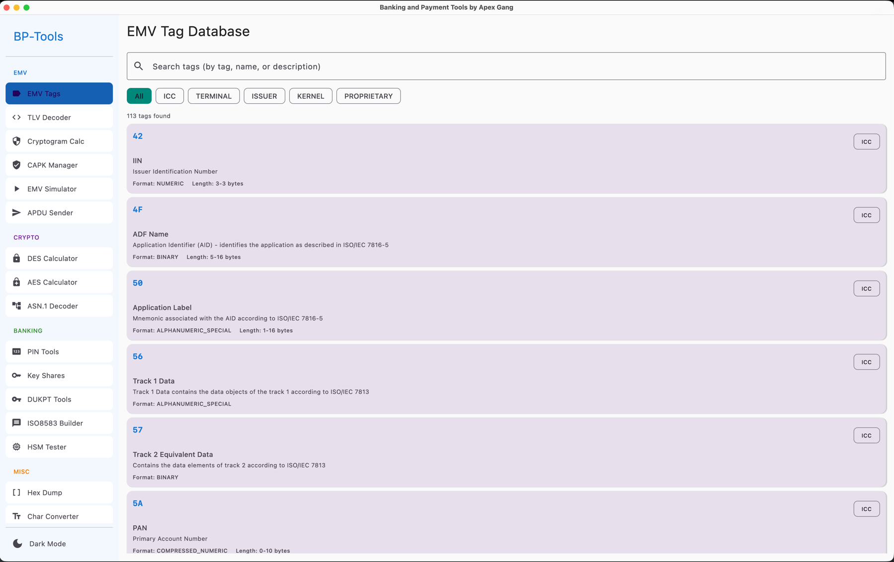
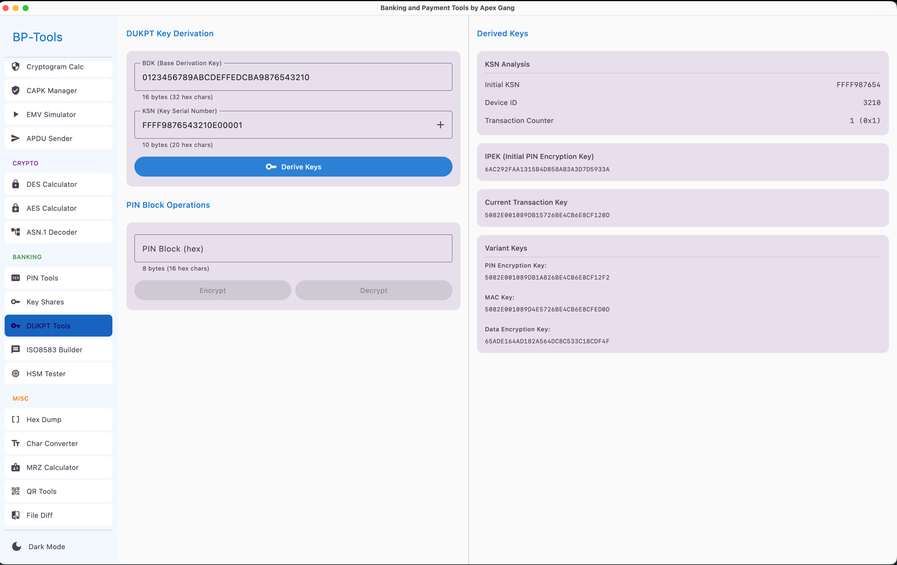
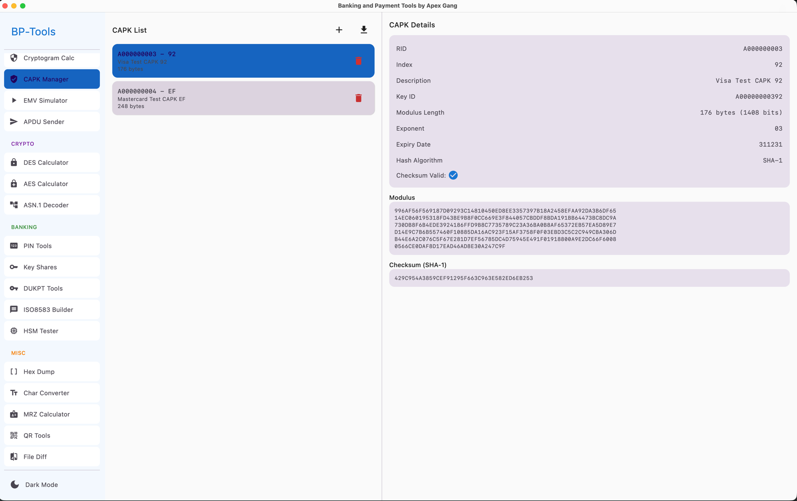
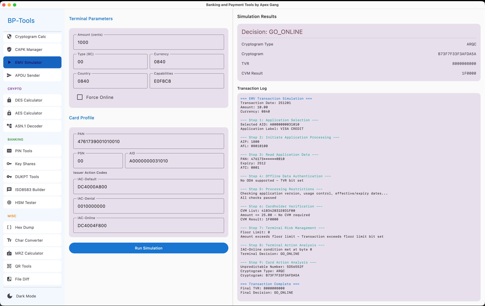

# BP Tools

A comprehensive desktop application for banking, payment, and EMV card development. Built with Kotlin and Jetpack Compose for Desktop.


## Features

### EMV Tools
- **EMV Tags** - Browse and search the complete EMV tag database with descriptions and formats
- **TLV Decoder** - Parse and decode TLV (Tag-Length-Value) encoded data
- **Cryptogram Calculator** - Calculate ARQC, ARPC, and other EMV cryptograms
- **CAPK Manager** - Manage Certification Authority Public Keys for EMV card validation
- **EMV Simulator** - Simulate EMV card transactions for testing
- **APDU Sender** - Send APDU commands to smart cards

### Cryptographic Tools
- **DES Calculator** - Perform DES/3DES encryption and decryption operations
- **AES Calculator** - Perform AES encryption and decryption with various modes
- **ASN.1 Decoder** - Parse and decode ASN.1 encoded data structures

### Banking Tools
- **PIN Tools** - PIN block generation and translation (ISO formats 0-4)
- **Key Shares** - Generate and combine cryptographic key shares using XOR
- **DUKPT Tools** - Derived Unique Key Per Transaction calculations
- **ISO8583 Builder** - Build and parse ISO8583 financial messages
- **HSM Tester** - Test Hardware Security Module commands

### Miscellaneous Tools
- **Hex Dump** - View binary data in hex dump format
- **Char Converter** - Convert between ASCII, Hex, Binary, and other formats
- **MRZ Calculator** - Calculate and validate Machine Readable Zone check digits
- **QR Tools** - Parse and generate QR codes for payment applications
- **File Diff** - Compare files and view differences

## Screenshots









## Requirements

- **Java 17+** (JDK with `jpackage` for building native distributions)
- **macOS 10.14+**, **Windows 10+**, or **Linux**

## Building from Source

### Prerequisites

Ensure you have a JDK 17+ installed with `jpackage` support (e.g., Amazon Corretto, Eclipse Temurin, or Oracle JDK).

```bash
# Check your Java version
java -version

# Set JAVA_HOME if needed
export JAVA_HOME=/path/to/your/jdk
```

### Build Commands

```bash
# Build the project
./gradlew build

# Run the application
./gradlew run

# Create native distribution for your platform
./gradlew packageDmg      # macOS
./gradlew packageMsi      # Windows
./gradlew packageDeb      # Linux (Debian/Ubuntu)

# Create distributable app bundle
./gradlew createDistributable
```

### Build Output

Native distributions are created in:
```
build/compose/binaries/main/dmg/    # macOS DMG
build/compose/binaries/main/msi/    # Windows MSI
build/compose/binaries/main/deb/    # Linux DEB
build/compose/binaries/main/app/    # App bundle
```

## Project Structure

```
src/main/kotlin/org/emvtools/
├── Main.kt                    # Application entry point
├── crypto/                    # Cryptographic implementations
│   ├── AesCalculator.kt
│   ├── CryptogramCalculator.kt
│   ├── DesCalculator.kt
│   ├── DukptCalculator.kt
│   ├── KeyShareGenerator.kt
│   └── PinBlockCalculator.kt
├── data/                      # Data sources
│   └── EmvTagDatabase.kt
├── model/                     # Data models
│   ├── CapkModels.kt
│   ├── EmvTag.kt
│   └── NavigationItem.kt
├── ui/                        # User interface
│   ├── MainScreen.kt
│   ├── components/
│   ├── screens/
│   └── theme/
└── util/                      # Utilities
    ├── Asn1Decoder.kt
    ├── CharConverter.kt
    ├── HexUtils.kt
    ├── Iso8583Parser.kt
    ├── MrzCalculator.kt
    ├── QrCodeParser.kt
    └── TlvParser.kt
```

## Dependencies

- **Jetpack Compose for Desktop** - Modern declarative UI framework
- **Bouncy Castle** - Cryptographic operations
- **Kotlinx Coroutines** - Asynchronous programming
- **Kotlinx Serialization** - JSON serialization

## Configuration

The application supports both light and dark themes, toggleable from the sidebar.

## License

*License information to be added*

## Contributing

Contributions are welcome! Please feel free to submit a Pull Request.

## Acknowledgments

- Built with [Compose Multiplatform](https://www.jetbrains.com/lp/compose-multiplatform/)
- Cryptographic operations powered by [Bouncy Castle](https://www.bouncycastle.org/)

---

**Triangle Labs** © 2024

